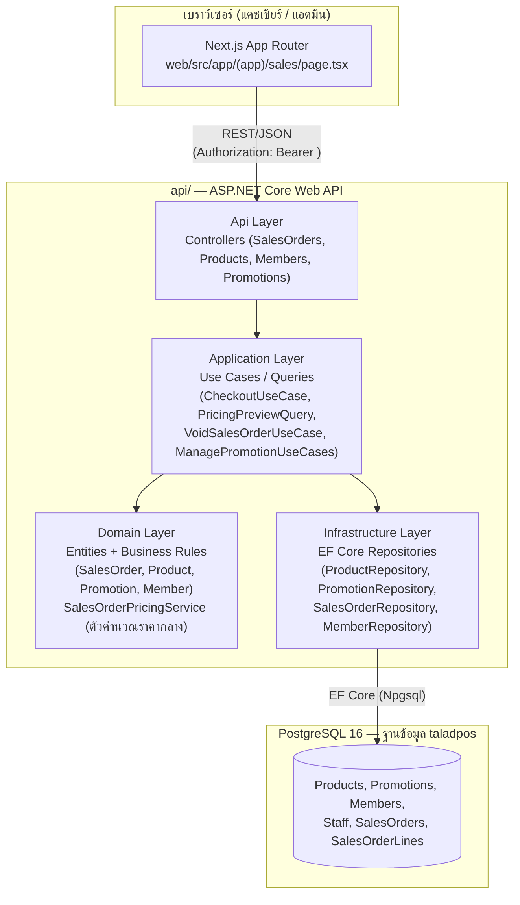

# ภาพรวมสถาปัตยกรรมระบบ (High-Level Architecture)

TaladPOS แยกเป็น 2 แอปพลิเคชันที่ deploy อิสระจากกัน คุยกันผ่าน REST/JSON เท่านั้น:

- **`web/`** — Next.js (App Router) + Tailwind + PrimeReact (unstyled) — หน้าจอที่แคชเชียร์/แอดมินใช้งาน
- **`api/`** — ASP.NET Core Web API แบบ DDD-layered (`Domain` / `Application` / `Infrastructure` / `Api`)
  หลังบ้านเป็น PostgreSQL ผ่าน EF Core

## ชั้น (Layer) และหน้าที่

| Layer | โปรเจกต์ | หน้าที่ในฟีเจอร์ขายสินค้า |
|---|---|---|
| Api | `TaladPOS.Api` | รับ HTTP request, ตรวจสิทธิ์ (`[Authorize]` / policy `Admin`), แปลง DTO ↔ Domain object |
| Application | `TaladPOS.Application` | ควบคุมขั้นตอนทางธุรกิจ (use case) เช่น `CheckoutUseCase`, `PricingPreviewQuery`, `VoidSalesOrderUseCase` — โหลดข้อมูลผ่าน repository interface แล้วเรียก Domain |
| Domain | `TaladPOS.Domain` | กติกาทางธุรกิจล้วนๆ ไม่ผูกกับฐานข้อมูล เช่น `SalesOrder.Checkout()`, `Product.DecreaseStock()`, และ **`SalesOrderPricingService`** ซึ่งเป็นจุดคำนวณราคา/ส่วนลดเพียงจุดเดียวของระบบ |
| Infrastructure | `TaladPOS.Infrastructure` | Repository implementation จริงที่คุยกับ PostgreSQL ผ่าน EF Core (`TaladPOSDbContext`) |

## หน้าจอ (Screens) ที่เกี่ยวข้องในระบบ

route ทั้งหมดอยู่ใต้ `web/src/app/`:

| Route | ใช้งานโดย | เกี่ยวข้องกับเอกสารนี้ |
|---|---|---|
| `/login` | ทุกคน | เข้าสู่ระบบ ได้ JWT (`token`) + ข้อมูล staff (`role: Cashier \| Admin`) เก็บใน `localStorage` |
| **`/sales`** | Cashier, Admin | **หน้าขายสินค้า — จุดโฟกัสหลักของเอกสารชุดนี้** ดูรายละเอียดที่ [`02-sales-screen.md`](./02-sales-screen.md) |
| `/stock` | Admin | จัดการสินค้า (เพิ่ม/แก้ไข/ปิดขาย) — ต้นทางของราคา/สต็อกที่หน้าขายใช้ |
| `/promotions` | Admin | จัดการโปรโมชั่น (CRUD) — ต้นทางของกติกาส่วนลดที่หน้าขายใช้คำนวณ |
| `/sales-history` | Admin | ดูประวัติการขายและ void ย้อนหลัง |
| `/reports` | Admin | รายงานสรุปยอดขาย |

## การยืนยันตัวตน (Authentication)

- Login สำเร็จจะได้ JWT กลับมา และ frontend แนบ header `Authorization: Bearer <token>` ทุก request
  (`web/src/lib/api/client.ts`)
- ฝั่ง API ใช้ `[Authorize]` เป็นค่าเริ่มต้นทุก controller และ endpoint ที่จำกัดเฉพาะแอดมินจะมี
  `[Authorize(Policy = "Admin")]` เพิ่ม เช่น การ void ออเดอร์, ดูประวัติการขายทั้งหมด, จัดการโปรโมชั่น/สินค้า
- `StaffId` ของผู้ขายจะถูกดึงจาก JWT claim ผ่าน `User.GetStaffId()` ในฝั่ง Controller ไม่ได้ส่งมาจาก frontend
  โดยตรง — ป้องกันการปลอมแปลงว่าใครเป็นคนขาย
