# หน้าจอขายสินค้า (Sales Screen)

**ไฟล์หลัก:** `web/src/app/(app)/sales/page.tsx` (component `SalesPage`)
**Layout ครอบ:** `web/src/app/(app)/layout.tsx` (บังคับต้อง login ก่อนเข้าถึงทุกหน้าใน group `(app)`)

## Component ย่อยที่ประกอบกันเป็นหน้านี้

| Component | ไฟล์ | หน้าที่ |
|---|---|---|
| `ProductCard` | `web/src/components/ProductCard.tsx` | การ์ดสินค้า 1 ใบ กดแล้วเพิ่มลงตะกร้า, disable เมื่อ `quantityOnHand <= 0` |
| `Cart` | `web/src/components/Cart.tsx` | แสดงรายการในตะกร้า, ปุ่ม +/-/ลบ, สรุป Subtotal/ส่วนลด/Total, ปุ่ม Checkout |
| `VoidOrderDialog` | `web/src/components/VoidOrderDialog.tsx` | ปุ่ม+ dialog ยืนยันการ void ออเดอร์ (แสดงเฉพาะ Admin และออเดอร์ที่ยังไม่ถูก void) |
| `MemberSignupDialog` | `web/src/components/MemberSignupDialog.tsx` | ฟอร์มสมัครสมาชิกใหม่แบบ popup เรียกจากหน้าขายโดยตรง |

## ฟังก์ชันหลักใน `SalesPage` และหน้าที่

| ฟังก์ชัน/Effect | ทำงานเมื่อ | สิ่งที่เกิดขึ้น |
|---|---|---|
| `useEffect` (ค้นหาสินค้า) | ทุกครั้งที่ `search` หรือ `token` เปลี่ยน | เรียก `searchProducts(token, search)` → set `products` |
| `useEffect` (คำนวณราคา) | ทุกครั้งที่ `cartLines` หรือ `linkedMember` เปลี่ยน | เรียก `pricingPreview(...)` → set `pricing` (ถ้าตะกร้าว่าง จะไม่เรียก API และ set เป็น `null`) |
| `addToCart(product)` | คลิกการ์ดสินค้า | เพิ่ม/เพิ่มจำนวนสินค้าในตะกร้า (client-side state เท่านั้น ไม่มี API เรียก) จำกัดไม่ให้เกิน `quantityOnHand` |
| `increase` / `decrease` / `remove` | ปุ่มในตะกร้า | ปรับ `cartLines` local state |
| `searchMember()` | กดปุ่ม "Find" | เรียก `findMemberByPhone(...)`; ถ้า 404 → แสดงตัวเลือก "Sign up" / "Continue" |
| `unlinkMember()` | กดปุ่ม "Unlink" หรือหลัง checkout สำเร็จ | ล้างสถานะสมาชิกที่ผูกกับตะกร้า |
| `handleCheckout()` | กดปุ่ม "Checkout" | เรียก `checkout(...)`, เคลียร์ตะกร้า, และ **re-fetch รายการสินค้า** เพื่ออัปเดตสต็อกที่แสดง |

## Flow Diagram — การใช้งานของแคชเชียร์

```mermaid
flowchart TD
    Start([แคชเชียร์เปิดหน้า /sales]) --> LoadProducts["โหลดสินค้าที่ Active ทั้งหมด\nGET /products"]
    LoadProducts --> Search{ค้นหาสินค้า?}
    Search -- "พิมพ์คำค้น" --> SearchAPI["GET /products?search=..."]
    SearchAPI --> ShowGrid["แสดงการ์ดสินค้าที่ตรงเงื่อนไข"]
    Search -- "ไม่ค้นหา" --> ShowGrid

    ShowGrid --> Tap["แตะการ์ดสินค้า"]
    Tap --> AddCart["เพิ่ม/เพิ่มจำนวนในตะกร้า (client state)"]
    AddCart --> Preview["GET /sales-orders/pricing-preview\n(ทุกครั้งที่ตะกร้าเปลี่ยน)"]
    Preview --> ShowTotal["แสดง Subtotal / ส่วนลดโปรโมชั่น /\nส่วนลดสมาชิก / Total"]
    ShowTotal --> MoreItems{ต้องการสินค้าเพิ่ม/แก้จำนวน?}
    MoreItems -- ใช่ --> ShowGrid
    MoreItems -- ไม่ --> Member{ผูกสมาชิกไหม?}

    Member -- "กรอกเบอร์โทร + Find" --> LookupMember["GET /members?phone=..."]
    LookupMember -->|พบ| Linked["ผูกสมาชิกกับตะกร้า\n(กระตุ้น pricing-preview ใหม่)"]
    LookupMember -->|ไม่พบ 404| NotFound{สมัครสมาชิกใหม่?}
    NotFound -- ใช่ --> Signup["POST /members\n(ผ่าน MemberSignupDialog)"]
    Signup --> Linked
    NotFound -- ไม่ --> Member
    Member -- "ไม่ผูกสมาชิก" --> Checkout

    Linked --> Checkout["กดปุ่ม Checkout"]
    Checkout --> CheckoutAPI["POST /sales-orders\n{ memberId, lines }"]
    CheckoutAPI -->|"201 Created"| Success["แสดง Sale completed banner\n+ เคลียร์ตะกร้า/สมาชิก\n+ re-fetch GET /products (สต็อกใหม่)"]
    CheckoutAPI -->|"409 สต็อกไม่พอ / 4xx อื่นๆ"| Fail["แสดง error, ตะกร้ายังอยู่ครบ\nให้แก้ไขแล้วลองใหม่"]
    Fail --> ShowGrid

    Success --> VoidChoice{Admin ต้องการ void?}
    VoidChoice -- ใช่ --> VoidConfirm["Dialog ยืนยัน\n(อธิบายผลกระทบ: คืนสต็อก, ตัดออกจากรายงาน,\nทำได้เฉพาะวันเดียวกัน, undo ไม่ได้)"]
    VoidConfirm -->|ยืนยัน| VoidAPI["POST /sales-orders/{id}/void"]
    VoidAPI --> VoidDone["ปุ่ม Void หายไปจาก banner\n(สต็อกที่แสดงบนการ์ดยังไม่รีเฟรช — ดูหมายเหตุด้านล่าง)"]
    VoidChoice -- ไม่ --> End([จบรายการขาย])
    VoidDone --> End
```

## รายการ API ที่หน้านี้เรียกใช้ทั้งหมด

| Method | Endpoint | ไฟล์ client | Auth | ใช้ตอนไหน |
|---|---|---|---|---|
| `GET` | `/products?search=` | `web/src/lib/api/products.ts` → `searchProducts` | ทุก staff | โหลด/ค้นหาสินค้า, และ re-fetch หลัง checkout สำเร็จ |
| `GET` | `/sales-orders/pricing-preview?productId=..&quantity=..&memberId=` | `web/src/lib/api/salesOrders.ts` → `pricingPreview` | ทุก staff | คำนวณยอดตะกร้าแบบ live ทุกครั้งที่ตะกร้า/สมาชิกเปลี่ยน (ไม่เขียนข้อมูล) |
| `GET` | `/members?phone=` | `web/src/lib/api/members.ts` → `findMemberByPhone` | ทุก staff | ค้นหาสมาชิกจากเบอร์โทร (404 ถ้าไม่พบ) |
| `POST` | `/members` | `web/src/lib/api/members.ts` → `signUpMember` | ทุก staff | สมัครสมาชิกใหม่จากหน้าขาย |
| `POST` | `/sales-orders` | `web/src/lib/api/salesOrders.ts` → `checkout` | ทุก staff | บันทึกการขายจริง ตัดสต็อก คำนวณส่วนลดสุดท้าย |
| `POST` | `/sales-orders/{id}/void` | `web/src/lib/api/salesOrders.ts` → `voidSalesOrder` | **Admin เท่านั้น** | ยกเลิกออเดอร์ที่เพิ่งขายในวันเดียวกัน |

ทุก request แนบ `Authorization: Bearer <JWT>` ผ่าน `apiFetch()` (`web/src/lib/api/client.ts`) และหากตอบกลับไม่ใช่
`2xx` จะถูกแปลงเป็น `ApiError` โดยอ่านจาก body รูปแบบ `{ error: { code, message } }`

## หมายเหตุ / ข้อสังเกตจากการทดสอบจริง

- **ราคาที่แสดงในตะกร้ามาจาก Backend เสมอ** (`pricing` state) — ฝั่งหน้าเว็บมี fallback คำนวณเอง
  (`fallbackTotal` ใน `Cart.tsx`) ใช้เฉพาะตอนที่ยังไม่มีผล pricing-preview กลับมาเท่านั้น (เช่น loading ครั้งแรก)
- สินค้าที่ `IsActive = false` (ปิดขายจากหน้า Stock) จะไม่ปรากฏในหน้าขายเลย แม้จะยังอยู่ในหน้า `/stock`
  ก็ตาม — เป็นพฤติกรรมตามสเปก ไม่ใช่บั๊ก
- **บั๊กที่พบจากการทดสอบจริง:** หลังกด Void สำเร็จ `VoidOrderDialog.onVoided` อัปเดตแค่ state ของออเดอร์ที่เพิ่ง
  void (`completedOrder`) แต่ **ไม่ได้เรียก `searchProducts` ซ้ำ** เหมือนตอน checkout ทำให้ตัวเลข "on hand"
  บนการ์ดสินค้าค้างค่าก่อน void จนกว่าจะรีเฟรชหน้าเอง (ข้อมูลจริงในฐานข้อมูลถูกต้องเสมอ กระทบแค่ UI)
