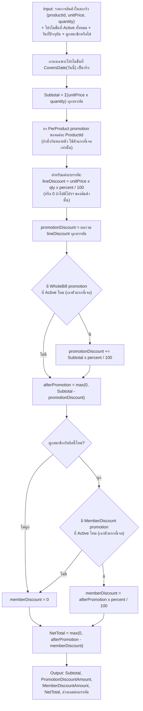
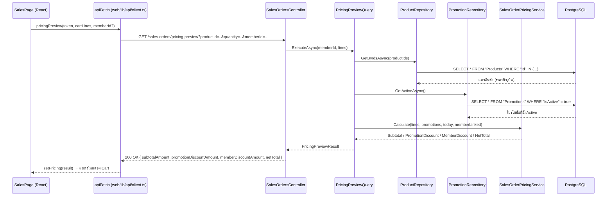
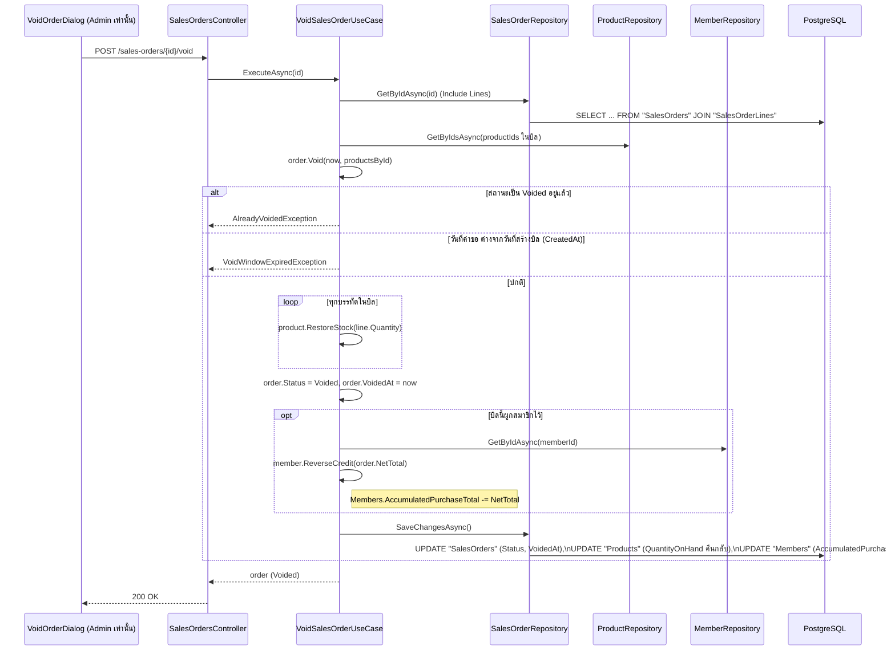

# การคำนวณโปรโมชั่นและส่วนลด (Pricing & Promotion Logic)

จุดคำนวณราคาทั้งหมดของระบบรวมอยู่ที่ฟังก์ชันเดียว:

> `SalesOrderPricingService.Calculate(...)`
> ไฟล์: `api/src/TaladPOS.Domain/Pricing/SalesOrderPricingService.cs`

ทั้ง **preview ตะกร้าแบบ live** (`PricingPreviewQuery`) และ **การคิดเงินจริงตอน checkout**
(`CheckoutUseCase`) เรียกฟังก์ชันนี้ตัวเดียวกัน จึงรับประกันได้ว่าตัวเลขที่แคชเชียร์เห็นระหว่างจัดตะกร้า
กับยอดที่ถูกตัดจริงจะไม่มีวันไม่ตรงกัน (เพราะเป็นโค้ดชุดเดียวกันทุกครั้ง ไม่ใช่การคำนวณซ้ำสองที่)

## ประเภทโปรโมชั่น (`PromotionScope`)

| Scope | ความหมาย | เงื่อนไข field `ProductId` |
|---|---|---|
| `PerProduct` | ลดราคาเฉพาะสินค้าชิ้นนั้น | ต้องระบุ `ProductId` |
| `WholeBill` | ลดราคาทั้งบิลเป็น % จากยอดรวม (subtotal) | ต้องเป็น `null` |
| `MemberDiscount` | ส่วนลดพิเศษเฉพาะลูกค้าที่เป็นสมาชิก (ผูกเบอร์โทรกับบิลแล้ว) | ต้องเป็น `null` |

โปรโมชั่นแต่ละตัวมี `DiscountPercent` (0–100), `StartDate`/`EndDate`, และ `IsActive` — เมธอด
`Promotion.CoversDate(date)` จะเป็นจริงเมื่อ `IsActive && StartDate <= date <= EndDate` เท่านั้น
การกรองตามวันที่ทำอยู่ **ใน** `SalesOrderPricingService` ดังนั้นผู้เรียกส่ง "โปรโมชั่นที่ยัง Active ทั้งหมด"
เข้ามาได้เลยโดยไม่ต้องกรองวันที่เอง

## อัลกอริทึมคำนวณ ทีละขั้นตอน



### สูตรสรุป

```
Subtotal              = Σ (unitPrice × quantity)  ทุกบรรทัดในตะกร้า
PromotionDiscount     = Σ (unitPrice × qty × perProductPercent / 100)   -- ต่อบรรทัดที่มีโปรฯ
                       + Subtotal × wholeBillPercent / 100              -- ถ้ามีโปรฯ ทั้งบิล
AfterPromotion         = max(0, Subtotal - PromotionDiscount)
MemberDiscount         = AfterPromotion × memberDiscountPercent / 100   -- เฉพาะถ้าผูกสมาชิก + มีโปรฯ ประเภทนี้
NetTotal               = max(0, AfterPromotion - MemberDiscount)
```

**จุดสำคัญ — ส่วนลดคิดแบบ "ต่อเนื่อง" (sequential), ไม่ใช่ขนาน:**
ส่วนลดสมาชิกคำนวณจาก `AfterPromotion` (ยอดหลังหักโปรโมชั่นสินค้า/ทั้งบิลแล้ว) ไม่ใช่จาก `Subtotal`
ตั้งต้น เช่น ถ้าซื้อของ 100 บาท มีโปรฯ ทั้งบิลลด 10% และส่วนลดสมาชิกอีก 5%:
`AfterPromotion = 100 - 10 = 90` → `MemberDiscount = 90 × 5% = 4.5` → `NetTotal = 85.5`
(ไม่ใช่ `100 - 10 - 5 = 85`)

### ข้อจำกัดของกติกาปัจจุบัน (ตามที่โค้ดกำหนดไว้จริง)

- ถ้าสินค้าชิ้นเดียวกันมีโปรโมชั่น `PerProduct` ที่ Active ซ้อนกันหลายตัว (ช่วงวันที่ทับกัน) ระบบจะใช้แค่
  **ตัวแรกที่เจอ** เท่านั้น (`GroupBy(...).First()`) — ระบบไม่รองรับการตั้งค่าซ้อนโปรฯ บนสินค้าเดียวกัน
- เช่นเดียวกัน ถ้ามีโปรโมชั่น `WholeBill` หรือ `MemberDiscount` Active พร้อมกันหลายตัว จะใช้ **ตัวแรกที่เจอ**
  เพียงตัวเดียว ไม่ใช่การรวมหรือเลือกตัวที่คุ้มที่สุด
- `MemberDiscount` จะไม่ถูกนำมาคิดเลยถ้าไม่ได้ผูกสมาชิกกับบิล (ค้นหาด้วยเบอร์โทรและกด "Find" สำเร็จ)

## Sequence Diagram — การ Preview ราคาแบบ Live (ไม่บันทึกอะไรลง DB)

เกิดขึ้นทุกครั้งที่ตะกร้าเปลี่ยน (เพิ่ม/ลด/ลบสินค้า, ผูก/เลิกผูกสมาชิก) ขณะยังไม่กด Checkout



**หมายเหตุ:** ขั้นตอนนี้ **ไม่แตะสต็อกและไม่เขียนลงตาราง `SalesOrders`/`SalesOrderLines`** เป็นการอ่าน
อย่างเดียว (read-only) ทั้งหมด

## Sequence Diagram — การ Checkout จริง (บันทึกการขาย + ตัดสต็อก + สะสมแต้ม)

```mermaid
sequenceDiagram
    participant UI as SalesPage (React)
    participant Client as apiFetch
    participant Ctrl as SalesOrdersController
    participant UC as CheckoutUseCase
    participant ProdRepo as ProductRepository
    participant MemRepo as MemberRepository
    participant PromoRepo as PromotionRepository
    participant Calc as SalesOrderPricingService
    participant Order as SalesOrder (Domain Aggregate)
    participant OrderRepo as SalesOrderRepository
    participant DB as PostgreSQL

    UI->>Client: checkout(token, lines, memberId?)
    Client->>Ctrl: POST /sales-orders { memberId, lines }
    Ctrl->>UC: ExecuteAsync(staffId จาก JWT, memberId, lines)
    UC->>ProdRepo: GetByIdsAsync(productIds)
    ProdRepo->>DB: SELECT * FROM "Products" WHERE "Id" IN (...)
    alt มี productId ที่ไม่พบในระบบ
        UC-->>Ctrl: ArgumentException (400)
    end
    opt ระบุ memberId มาด้วย
        UC->>MemRepo: GetByIdAsync(memberId)
        MemRepo->>DB: SELECT * FROM "Members" WHERE "Id" = ...
        alt ไม่พบสมาชิก
            UC-->>Ctrl: ArgumentException (400/422)
        end
    end
    UC->>PromoRepo: GetActiveAsync()
    PromoRepo->>DB: SELECT * FROM "Promotions" WHERE "IsActive" = true
    UC->>Calc: Calculate(lines, promotions, today, memberLinked)
    Calc-->>UC: pricing result (ยึดเป็นค่าตัดจริง)
    UC->>Order: SalesOrder.Checkout(staffId, memberId, items, pricing)
    loop ทุกบรรทัดสินค้า
        Order->>Order: product.DecreaseStock(quantity)
        alt สต็อกไม่พอ
            Order-->>UC: InsufficientStockException → 409 Conflict
        end
        Order->>Order: สร้าง SalesOrderLine (snapshot ชื่อ+ราคา ณ ขณะขาย + lineDiscount)
    end
    Order->>Order: SubtotalAmount / PromotionDiscountAmount / MemberDiscountAmount / NetTotal = ผลจาก pricing
    opt ผูกสมาชิก
        UC->>Order: member.Credit(order.NetTotal)
        Note right of Order: Members.AccumulatedPurchaseTotal += NetTotal
    end
    UC->>OrderRepo: AddAsync(order) + SaveChangesAsync()
    OrderRepo->>DB: INSERT "SalesOrders", INSERT "SalesOrderLines" (หลายแถว),\nUPDATE "Products" (QuantityOnHand ลดลง),\nUPDATE "Members" (AccumulatedPurchaseTotal เพิ่ม)
    DB-->>OrderRepo: commit สำเร็จ (ใน 1 transaction ของ EF Core SaveChanges)
    OrderRepo-->>UC: SalesOrder ที่บันทึกแล้ว
    UC-->>Ctrl: order
    Ctrl-->>Client: 201 Created { id, status: "Completed", subtotalAmount, ... , lines: [...] }
    Client-->>UI: setCompletedOrder(order); เคลียร์ตะกร้า; re-fetch GET /products
```

### ทำไม Checkout ถึงไม่มีวันคำนวณได้ตัวเลขต่างจาก Preview

`CheckoutUseCase` และ `PricingPreviewQuery` ต่างก็:
1. โหลดราคาสินค้าปัจจุบันจากตาราง `Products` ชุดเดียวกัน
2. โหลดโปรโมชั่น Active ชุดเดียวกันจากตาราง `Promotions`
3. ส่งเข้า `SalesOrderPricingService.Calculate(...)` ฟังก์ชันเดียวกันเป๊ะ

ต่างกันแค่ `CheckoutUseCase` เอาผลลัพธ์ไป "ใช้จริง" (ตัดสต็อก บันทึกบิล) ส่วน `PricingPreviewQuery`
แค่ "คืนตัวเลขให้ดู" เท่านั้น — ราคาจึงมีโอกาสต่างกันได้กรณีเดียวคือ **ระหว่างที่แคชเชียร์เปิดตะกร้าค้างไว้
แล้วแอดมินไปแก้ราคาสินค้าหรือเปลี่ยนโปรโมชั่นพอดี** (race condition ตามเวลาจริง ไม่ใช่บั๊กของโค้ด)

## Void ออเดอร์ กระทบส่วนลด/สต็อก/แต้มสมาชิกอย่างไร

ไฟล์: `api/src/TaladPOS.Application/SalesOrders/VoidSalesOrderUseCase.cs`,
`api/src/TaladPOS.Domain/Entities/SalesOrder.cs` (เมธอด `Void`)



กติกาสำคัญ: void ได้ครั้งเดียว (`AlreadyVoidedException` กันการ void ซ้ำ) และทำได้เฉพาะ
**วันปฏิทินเดียวกับที่สร้างบิล** เท่านั้น (`VoidWindowExpiredException` ถ้าข้ามวันแล้ว) — ส่วนลด
โปรโมชั่นที่เคยบันทึกไว้ (`PromotionDiscountAmount`, `MemberDiscountAmount`, `LineDiscountAmount` ต่อบรรทัด)
**จะไม่ถูกลบหรือคำนวณใหม่** ยังคงอยู่ในบันทึกเดิมเพื่อการตรวจสอบย้อนหลัง มีเพียงสต็อกและแต้มสมาชิกเท่านั้น
ที่ถูกคืนกลับ
