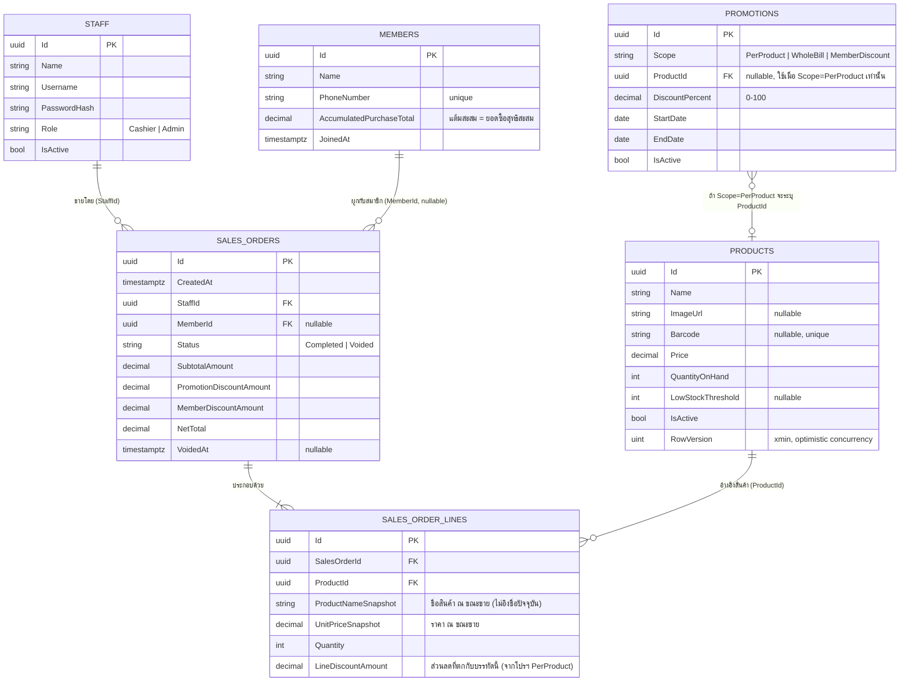

# ตารางฐานข้อมูลที่ใช้งานในฟีเจอร์ขายสินค้า/โปรโมชั่น

ฐานข้อมูล: PostgreSQL 16 (database `taladpos`) เข้าถึงผ่าน EF Core (`TaladPOSDbContext`,
`api/src/TaladPOS.Infrastructure/Persistence/`) ตารางทั้งหมดในระบบ (ตรวจสอบจริงด้วย `\dt` ใน `psql`):

`Products`, `Promotions`, `Members`, `Staff`, `SalesOrders`, `SalesOrderLines`
(และ `__EFMigrationsHistory` ซึ่งเป็นตารางภายในของ EF Core ไม่เกี่ยวกับ business logic)

## ER Diagram

## รายละเอียดตาราง และใครเป็นคนอ่าน/เขียน

### `Products`
สินค้าที่ขายได้ในร้าน (single-store catalog)

| การเข้าถึงจากฟีเจอร์ขาย | จุดไหนในโค้ด |
|---|---|
| อ่าน (ค้นหา/แสดงในกริดสินค้า) | `ProductRepository.SearchAsync` — กรอง `IsActive` เสมอเมื่อไม่ใช่แอดมิน, ค้นหาด้วย `ILIKE` บนชื่อ หรือ `Barcode` ตรงเป๊ะ |
| อ่าน (ตอนคำนวณราคา/checkout) | `ProductRepository.GetByIdsAsync` — ใช้ `Price` ปัจจุบันเป็น input ให้ `SalesOrderPricingService` |
| เขียน (ตัดสต็อก) | `Product.DecreaseStock()` ถูกเรียกจาก `SalesOrder.Checkout()` ระหว่าง checkout |
| เขียน (คืนสต็อก) | `Product.RestoreStock()` ถูกเรียกจาก `SalesOrder.Void()` ระหว่าง void |

`RowVersion` (คอลัมน์ระบบ `xmin` ของ PostgreSQL) ใช้เป็น optimistic concurrency token — ป้องกันการขาย
สินค้าตัวเดียวกันพร้อมกันจนสต็อกติดลบจากสองธุรกรรมที่แข่งกัน (ถ้าชนกัน EF Core จะโยน concurrency
exception ให้ retry แทนที่จะเขียนทับเงียบๆ)

### `Promotions`
กติกาส่วนลดแบบมีช่วงเวลา (time-boxed percentage discount)

| การเข้าถึงจากฟีเจอร์ขาย | จุดไหนในโค้ด |
|---|---|
| อ่าน (ทุกครั้งที่ preview/checkout) | `PromotionRepository.GetActiveAsync()` → `SELECT * FROM "Promotions" WHERE "IsActive" = true` แล้วกรองตามวันที่ในโค้ด (`Promotion.CoversDate`) ไม่ได้กรองที่ SQL |
| เขียน (CRUD) | ผ่านหน้า `/promotions` (Admin เท่านั้น) → `ManagePromotionUseCases`, ไม่เกี่ยวกับหน้าขายโดยตรง |

### `Members`
ลูกค้าที่เป็นสมาชิก (loyalty program)

| การเข้าถึงจากฟีเจอร์ขาย | จุดไหนในโค้ด |
|---|---|
| อ่าน (ค้นหาด้วยเบอร์โทร) | `MemberRepository.GetByPhoneNumberAsync` ผ่าน endpoint `GET /members?phone=` |
| อ่าน (ตอน checkout ถ้าระบุ memberId) | `MemberRepository.GetByIdAsync` — ต้องพบ ไม่งั้น checkout ล้มเหลวทั้งบิลตั้งแต่ต้น (กันสต็อกถูกตัดไปก่อนเจอ error) |
| เขียน (สะสมแต้ม) | `Member.Credit(order.NetTotal)` ตอน checkout สำเร็จ |
| เขียน (ถอนแต้มคืน) | `Member.ReverseCredit(order.NetTotal)` ตอน void ออเดอร์ที่ผูกสมาชิกไว้ |

`AccumulatedPurchaseTotal` คือยอดซื้อสุทธิ (NetTotal หลังหักส่วนลดทุกประเภทแล้ว) สะสมของสมาชิกคนนั้น
ไม่ใช่ยอดก่อนหักส่วนลด

### `Staff`
บัญชีผู้ใช้งานระบบ (login ได้)

| การเข้าถึงจากฟีเจอร์ขาย | จุดไหนในโค้ด |
|---|---|
| อ่าน (login) | ตรวจ username/password ตอน `/login` (นอกขอบเขตเอกสารนี้) |
| อ่าน (ระบุคนขาย) | `StaffId` ถูกฝังใน `SalesOrders.StaffId` จาก JWT claim ตอน checkout ไม่ใช้จาก input ของ client |

`Role` (`Cashier`/`Admin`) กำหนดว่าใครเห็นปุ่ม Void, เข้าหน้า `/promotions` `/stock` `/sales-history`
`/reports` ได้หรือไม่ (ผ่าน `[Authorize(Policy = "Admin")]` ฝั่ง API)

### `SalesOrders`
1 แถว = 1 ธุรกรรมการขาย (aggregate root)

เขียนครั้งแรกตอน checkout (`INSERT`), แก้ไขได้อีกครั้งเดียวตอน void (`UPDATE Status, VoidedAt`) — ไม่มี
การแก้ไขยอดเงินย้อนหลังหลังจากสร้างแล้ว (`SubtotalAmount`, `PromotionDiscountAmount`,
`MemberDiscountAmount`, `NetTotal` คงที่ตลอดไปแม้จะถูก void)

### `SalesOrderLines`
1 แถว = 1 บรรทัดสินค้าในบิลนั้น สร้างพร้อมกับ `SalesOrders` ในทรานแซกชันเดียวกัน (ไม่มีการ insert/update
แยกทีหลัง) ใช้ `ProductNameSnapshot` และ `UnitPriceSnapshot` แทนการ join ไปอ่านค่าปัจจุบันจาก `Products`
โดยตรง — เพื่อให้ประวัติการขายแม่นยำแม้ภายหลังแอดมินจะเปลี่ยนชื่อ/ราคาสินค้านั้นไปแล้ว
