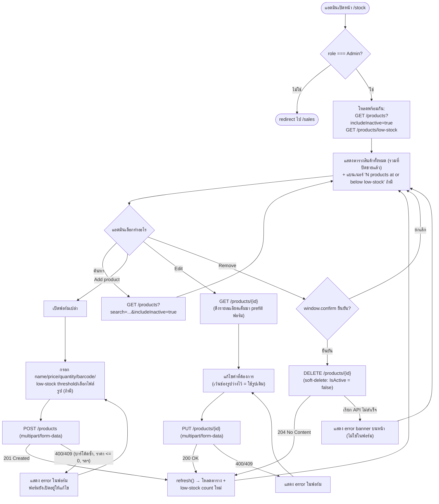

# หน้าจอจัดการสต็อกสินค้า (Stock Screen)

**ไฟล์หลัก:** `web/src/app/(app)/stock/page.tsx` (component `StockPage`)
**การ์ดกันสิทธิ์:** `web/src/app/(app)/stock/layout.tsx` (`StockLayout`) — redirect ไป `/sales` ทันทีถ้า
`staff.role !== "Admin"` (เช็คหลัง `isLoading` เสร็จเท่านั้น กันการ flash เนื้อหาก่อนรู้ role จริง)

## Component ย่อยที่ประกอบกันเป็นหน้านี้

| Component | ไฟล์ | หน้าที่ |
|---|---|---|
| `StockPage` | `web/src/app/(app)/stock/page.tsx` | ตาราง `DataTable` (PrimeReact) แสดงสินค้าทั้งหมด + ช่องค้นหา + แบนเนอร์ low-stock |
| `ProductFormDialog` | `web/src/components/ProductFormDialog.tsx` | ฟอร์ม popup ใช้ร่วมกันทั้งตอนเพิ่มและแก้ไขสินค้า (ตัดสินจาก prop `product` ว่ามีค่าหรือไม่) |

## ฟังก์ชันหลักใน `StockPage` และหน้าที่

| ฟังก์ชัน/Effect | ทำงานเมื่อ | สิ่งที่เกิดขึ้น |
|---|---|---|
| `refresh()` (ผ่าน `useCallback` + `useEffect`) | โหลดหน้าครั้งแรก, ทุกครั้งที่ `search` เปลี่ยน, และหลังบันทึก/ลบสินค้าสำเร็จ | ยิง `searchProducts(token, search, true)` และ `getLowStockProducts(token)` **พร้อมกัน** (`Promise.all`) แล้ว set `products` และ `lowStockCount` |
| `openAddDialog()` | กดปุ่ม "Add product" | เคลียร์ `editingProduct` เป็น `undefined` แล้วเปิด dialog (ฟอร์มว่างเปล่า) |
| `openEditDialog(product)` | กดปุ่ม "Edit" ที่แถวสินค้า | เรียก `getProduct(token, product.id)` เพื่อดึงรายละเอียดเต็ม (`ProductDetail` มี `lowStockThreshold`/`isActive` ที่ตัว list summary ไม่มี) มา prefill ฟอร์ม แล้วเปิด dialog |
| `handleDelete(product)` | กดปุ่ม "Remove" | ยืนยันด้วย `window.confirm(...)` ก่อน แล้วเรียก `deleteProduct(token, product.id)` (เป็น soft-delete ฝั่ง backend) จากนั้น `refresh()` |
| `ProductFormDialog.handleSubmit` | กด "Save" ในฟอร์ม | ถ้ามี prop `product` → `updateProduct(...)`, ถ้าไม่มี → `createProduct(...)` แล้วเรียก `onSaved()` ซึ่งชี้กลับมาที่ `refresh()` ของหน้าแม่ |

## Flow Diagram — การใช้งานของแอดมิน

## รายการ API ที่หน้านี้เรียกใช้ทั้งหมด

| Method | Endpoint | ไฟล์ client | Auth | ใช้ตอนไหน |
|---|---|---|---|---|
| `GET` | `/products?search=&includeInactive=true` | `web/src/lib/api/products.ts` → `searchProducts` | Admin (endpoint ใช้ร่วมกับ Cashier ได้ แต่ `includeInactive` จะถูกเซิร์ฟเวอร์เพิกเฉยถ้าไม่ใช่ Admin) | โหลด/ค้นหาตารางสินค้าทั้งหมด |
| `GET` | `/products/low-stock` | `web/src/lib/api/products.ts` → `getLowStockProducts` | **Admin เท่านั้น** (`[Authorize(Policy = "Admin")]`) | นับจำนวนสินค้าที่ถึงเกณฑ์ low-stock มาแสดงเป็นแบนเนอร์ |
| `GET` | `/products/{id}` | `web/src/lib/api/products.ts` → `getProduct` | ทุก staff | ดึงรายละเอียดเต็มของสินค้ามา prefill ฟอร์มตอนกด Edit |
| `POST` | `/products` (multipart/form-data) | `web/src/lib/api/products.ts` → `createProduct` | **Admin เท่านั้น** | สร้างสินค้าใหม่ |
| `PUT` | `/products/{id}` (multipart/form-data) | `web/src/lib/api/products.ts` → `updateProduct` | **Admin เท่านั้น** | แก้ไขสินค้าเดิม |
| `DELETE` | `/products/{id}` | `web/src/lib/api/products.ts` → `deleteProduct` | **Admin เท่านั้น** | ปิดการขายสินค้า (soft-delete) |

หมายเหตุ: `POST`/`PUT` ส่งเป็น `multipart/form-data` (ไม่ใช่ JSON) เพราะแนบไฟล์รูปภาพได้ — ไฟล์
`web/src/lib/api/client.ts` (`apiFetch`) จะไม่ใส่ header `Content-Type: application/json` เองเมื่อ body
เป็น `FormData` ปล่อยให้เบราว์เซอร์ตั้ง header แบบ multipart พร้อม boundary ให้อัตโนมัติ

## หมายเหตุ / ข้อสังเกตจากการอ่านโค้ดจริง

- `searchProducts` ที่หน้า Stock เรียกจะส่ง `includeInactive=true` เสมอ แต่ backend
  (`ProductsController.Search`) จะ "เพิกเฉย" ค่านี้เงียบๆ ถ้าผู้เรียกไม่ใช่ Admin แทนที่จะตอบ error —
  เป็นการตัดสินใจตั้งใจ (มีคอมเมนต์ในโค้ดระบุไว้) เพราะ endpoint เดียวกันนี้ถูก Cashier เรียกใช้ที่หน้า
  Sales อยู่แล้วโดยชอบธรรม จึงไม่อยากให้ request ล้มเหลวแค่เพราะมี query param เกินสิทธิ์ติดมา
- ฟอร์ม Edit ไม่บังคับแนบรูปใหม่ — ถ้าปล่อยว่าง backend (`ProductsController.Update`) จะไปอ่าน
  `ImageUrl` เดิมจากฐานข้อมูลมาใช้ต่อ ไม่ได้ล้างรูปทิ้งเฉยๆ
