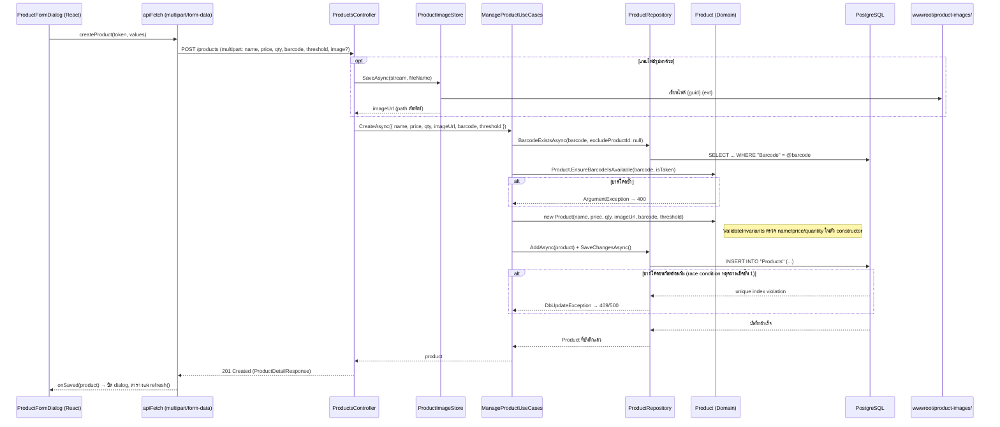
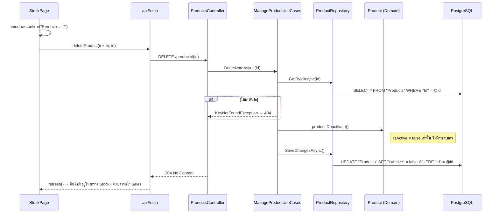

# กติกาทางธุรกิจของสินค้า (Product Lifecycle Logic)

ไฟล์หลักที่ถือกติกา: `api/src/TaladPOS.Domain/Entities/Product.cs` (Domain Entity — private setter
ทุกฟิลด์ แก้ไขได้ผ่านเมธอดที่ตรวจเงื่อนไขเท่านั้น ไม่มีทางเขียนค่าที่ผิดกติกาลงไปได้จากภายนอก)

## กติกาการสร้าง/แก้ไขสินค้า (`ValidateInvariants`)

เรียกทั้งตอน constructor (สร้างใหม่) และตอน `Edit()` (แก้ไข) — กติกาเดียวกันใช้ทั้งสองที่:

| เงื่อนไข | ผลถ้าไม่ผ่าน |
|---|---|
| `Name` ต้องไม่ว่าง/ไม่เป็นช่องว่างล้วน | `ArgumentException` |
| `Price` ต้องมากกว่า 0 | `ArgumentOutOfRangeException` |
| `QuantityOnHand` ต้องไม่ติดลบ | `ArgumentOutOfRangeException` |

Exception เหล่านี้ถูกแปลงเป็น HTTP 400 โดย error-handling middleware ของ API (ไม่ได้ตรวจซ้ำที่ Controller
หรือฝั่งหน้าเว็บ นอกจาก `required`/`min` ระดับพื้นฐานบน `<input>` ที่กันได้แค่กรณีง่ายๆ)

## บาร์โค้ดต้องไม่ซ้ำ — บังคับสองชั้น (defense in depth)

**ชั้นที่ 1 (Application layer, เพื่อ error message ที่อ่านง่าย):**
`ManageProductUseCases.EnsureBarcodeIsAvailableAsync()` เรียก
`ProductRepository.BarcodeExistsAsync(barcode, excludeProductId)` ก่อนบันทึกทุกครั้ง (ตอนแก้ไขจะ
`excludeProductId` เป็น id ของตัวเองเพื่อไม่ให้ชนกับบาร์โค้ดของตัวเอง) แล้วส่งผลไปให้
`Product.EnsureBarcodeIsAvailable(barcode, isTaken)` (static method บน Domain) ตัดสินใจว่าจะโยน
`ArgumentException` หรือไม่ — เป็น pure function ทดสอบได้โดยไม่ต้องมีฐานข้อมูลจริง

**ชั้นที่ 2 (Database, การันตีจริงแม้ request ชนกันพร้อมกัน):**
`ProductConfiguration.cs` (EF Core Fluent API) ประกาศ unique partial index บนคอลัมน์ `Barcode`:

```csharp
builder.HasIndex(p => p.Barcode)
    .IsUnique()
    .HasFilter("\"Barcode\" IS NOT NULL");
```

`HasFilter("\"Barcode\" IS NOT NULL")` ทำให้ index นี้ไม่บังคับความ unique กับแถวที่ `Barcode` เป็น
`NULL` (สินค้าที่ไม่มีบาร์โค้ดมีได้หลายชิ้น) แต่บาร์โค้ดที่มีค่าจริงจะซ้ำกันไม่ได้เด็ดขาดในระดับฐานข้อมูล
— ชั้นที่ 1 มีไว้ให้ประสบการณ์ผู้ใช้ดี (ข้อความ error ชัดเจน) ส่วนชั้นที่ 2 คือด่านที่ป้องกันจริงถ้าสอง
request มาพร้อมกันแล้วผ่านชั้นที่ 1 ไปทั้งคู่ (race condition) — ฐานข้อมูลจะปฏิเสธ request ที่สองด้วย
unique-violation แทน

## การอัปโหลดรูปสินค้า

- ไม่ได้เก็บรูปเป็น binary ในฐานข้อมูล — คอลัมน์ `Products.ImageUrl` เก็บแค่ **path สัมพัทธ์เป็น string**
  (เช่น `/product-images/3f9a....jpg`)
- ไฟล์จริงเก็บบนดิสก์ของเซิร์ฟเวอร์ที่ `wwwroot/product-images/` ผ่าน
  `ProductImageStore.SaveAsync()` (`api/src/TaladPOS.Infrastructure/Storage/ProductImageStore.cs`)
  — ตั้งชื่อไฟล์ใหม่ด้วย `Guid.NewGuid()` เสมอ (กันชื่อไฟล์ชนกัน/กันคนเดายื่อไฟล์ต้นฉบับจากชื่อ)
- เป็นการตัดสินใจทางสถาปัตยกรรมที่เหมาะกับสเกล "ร้านเดียว" (single-store) — ไม่ต้องพึ่ง cloud blob
  storage ภายนอก แต่ก็หมายความว่า **รูปภาพไม่ได้อยู่ใน backup ของฐานข้อมูล** ถ้า deploy เซิร์ฟเวอร์ใหม่
  หรือย้ายเครื่องต้องย้ายโฟลเดอร์ `wwwroot/product-images/` ไปด้วยเอง

## Soft-delete — ทำไมไม่ลบแถวจริง

`Product.Deactivate()` แค่ตั้ง `IsActive = false` ไม่มีการ `DELETE` แถวออกจากตาราง `Products`
เหตุผล (ตามคอมเมนต์ในโค้ด FR-011): ตาราง `SalesOrderLine` เก็บ `ProductNameSnapshot`/
`UnitPriceSnapshot` ไว้เองอยู่แล้วก็จริง แต่ยังมี **foreign key `ProductId`** ชี้กลับมาที่แถวสินค้านี้
— ถ้าลบแถวจริงจะทำให้ประวัติการขายเก่าอ้างอิง id ที่ไม่มีอยู่จริง (broken reference) จึงเลือก soft-delete
แทน ผลคือสินค้าที่ปิดขายแล้ว:
- **หายไปจากหน้าขาย** (`/sales` ค้นหาแบบ default ไม่รวม inactive)
- **ยังอยู่ในหน้า Stock** (แอดมินส่ง `includeInactive=true` เสมอ เห็นได้แต่แก้ไข/เปิดขายกลับไม่ได้ในตอนนี้
  — โค้ดปัจจุบันไม่มี endpoint "reactivate" ให้ย้อนกลับ `IsActive = true`)
- **บิลเก่าที่เคยขายสินค้านี้ยังแสดงผลถูกต้องเป๊ะ** ในหน้าประวัติการขาย เพราะอ่านจาก snapshot ไม่ใช่
  ข้อมูลปัจจุบันของสินค้า

## `IsLowStock` — คำนวณสด ไม่ใช่ค่าที่เก็บไว้

```csharp
public bool IsLowStock => LowStockThreshold.HasValue && QuantityOnHand <= LowStockThreshold.Value;
```

เป็น computed property คำนวณใหม่ทุกครั้งที่อ่าน ไม่ใช่คอลัมน์ในฐานข้อมูล — สินค้าที่ไม่ได้ตั้ง
`LowStockThreshold` ไว้ (เป็น `null`) จะไม่มีวัน "low stock" ไม่ว่าสต็อกจะเหลือเท่าไหร่ก็ตาม

## Sequence Diagram — สร้างสินค้าใหม่ (พร้อมอัปโหลดรูป)



## Sequence Diagram — ปิดการขายสินค้า (Soft Delete)


